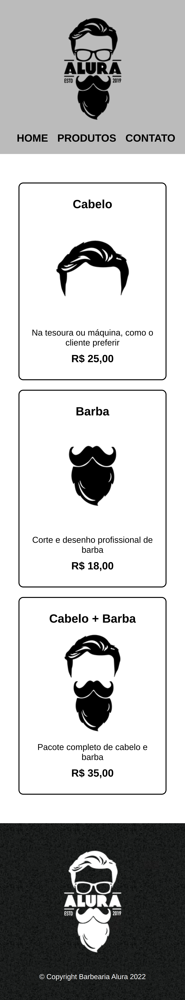
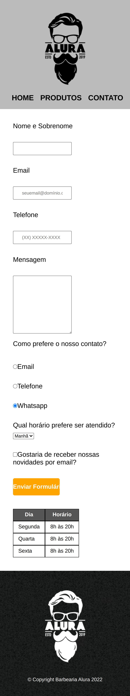

# Barbearia Alura

Primeiro projeto da formação HTML e CSS 

| :placard: Vitrine.Dev |     |
| -------------  | --- |
| :sparkles: Nome        | **Barbearia Alura**
| :label: Tecnologias | HTML e CSS
| :rocket: URL         | https://barbearia-alura-rho.vercel.app/
| :fire: Desafio     | -

## Detalhes do projeto

Projeto de um site responsivo de uma barbearia usando HTML e CSS. 
Esse foi o primeiro projeto executado enquanto eu cursava a formação de HTML e CSS da Alura. 
Foi meu primeiro contato com a área de programação. Nesse projeto aprendi: 
 • O que é HTML e CSS;  
• As ferramentas dos navegadores para se desenvolver uma página web;  
• Estilização de uma paǵina web;  
• Criação de listas e formulários;  

## Screenshots

## Desktop

## Mobile

</img>
</img>
</img>

